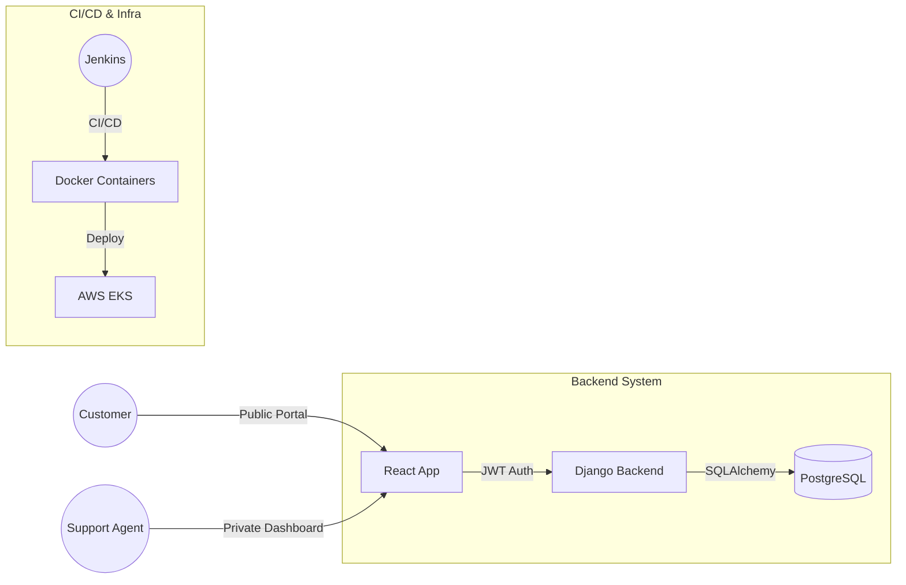

# InsightOps | Enterprise Support Dashboard

InsightOps is a premium support ticket management platform with a sophisticated, light-themed dashboard design. It combines Django's robustness with a state-of-the-art React interface.

## 📊 Architecture Diagram



## 🚀 Key Features
- **Elite Dashboard UI**: Modeled after top-tier enterprise SaaS platforms.
- **Bi-Portal Access**: Dedicated views for customers (public) and agents (private).
- **JWT Authentication**: Full security for internal ticket management.
- **Stats & Analytics**: Real-time visualization of ticket usage and staff alerts.
- **Django Backend**: Scalable, secure API with PostgreSQL persistence.

## 📦 Tech Stack
- **Frontend**: React (Vite), TailwindCSS, Lucide Icons
- **Backend**: Django REST Framework, SimpleJWT
- **Database**: PostgreSQL
- **Infrastructure**: Docker, Jenkins, Terraform, Kubernetes (AWS)

## 🛠 Getting Started

1. **Launch Stack**:
   ```bash
   docker-compose up --build
   ```
2. **Access**:
   - Dashboard: `http://localhost:3000`
   - Customer Portal: `http://localhost:3000/customer`
   - Django API: `http://localhost:8000/api`
